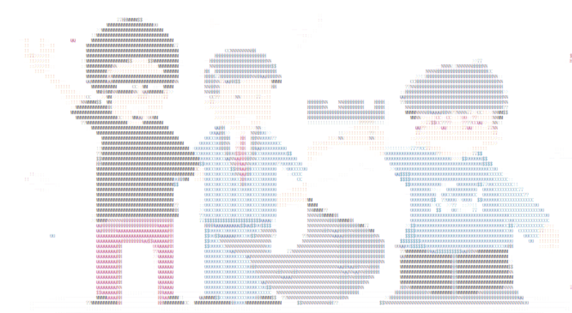

# Image to ASCII Converter

A C++ program that converts images and videos into ASCII art with multiple display styles.

## Usage

1. Compile the program using your C++ compiler
2. Run the executable
3. Choose a display style:
   - 0: Black and white ASCII image
   - 1: Foreground color ASCII image
   - 2: Foreground and background color ASCII image

